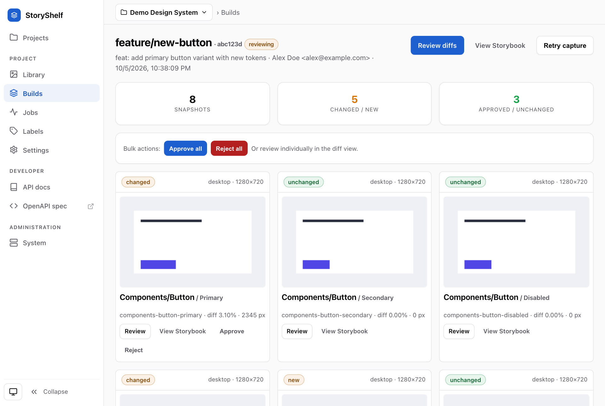

# StoryShelf

[](https://www.npmjs.com/package/storyshelf)
[](https://github.com/GuptaSiddhant/StoryShelf/actions/workflows/ci.yml)
[](LICENSE)

Self-hosted visual testing platform for Storybook. Run visual regression tests in CI, review pixel-level diffs in a web UI, and approve changes before they ship.

**Self-hosted Chromatic alternative. Storybook-native. Unlimited snapshots.**

[**Live demo**](https://storyshelf.fly.dev) · [**Documentation**](https://storyshelf.js.org) · [Getting started](https://storyshelf.js.org/guides/getting-started/)



## Features

- **Unlimited snapshots.** MIT-licensed; you pay for your own infrastructure, not per snapshot.
- **Per-branch baselines** with fallback to the default branch, auto-approved on `main`.
- **Published Storybook.** Share the latest build of each project at a stable URL.
- **One `docker run` to self-host**, or Terraform stacks for AWS, Azure, and GCP. Bring your own database, storage, and queue.
- **Server-side capture.** Upload your built Storybook; Playwright (Chromium, Firefox, WebKit) or Puppeteer renders it, including `play` functions.
- **Review workflow.** Approve or reject, threaded comments, and GitHub/GitLab merge-gate status checks.

## StoryShelf vs Chromatic

| | Chromatic (SaaS) | StoryShelf (self-hosted) |
|---|---|---|
| **Pricing** | 5k snapshots free, then $179/mo per 35k | MIT, unlimited; infrastructure cost only |
| **Hosting** | Chromatic cloud only | Your infrastructure |
| **Data residency** | US / EU regions | Your database and storage |
| **Interaction tests** | `play` functions | `play` functions |
| **Lock-in** | Proprietary | Open source, standard `/api/v1` |

Full breakdown: [Chromatic comparison](https://storyshelf.js.org/guides/chromatic-comparison/) · [Migration guide](https://storyshelf.js.org/guides/chromatic-migration/).

## Layout

```
packages/
  core/           @storyshelf/core          — Adapter interfaces, models, capture pipeline, diff, retention (no HTTP)
  app/            @storyshelf/app           — Hono app, API routes, server-rendered UI over core
  db-sqlite/      @storyshelf/db-sqlite      — SQLite database adapters (node:sqlite default + turso/better-sqlite3/bun-sqlite/d1 presets)
  db-postgres/    @storyshelf/db-postgres    — Postgres database adapter (postgres.js + Drizzle)
  storage-local/  @storyshelf/storage-local — local filesystem storage
  storage-s3/     @storyshelf/storage-s3    — S3-compatible storage
  auth/         @storyshelf/auth        — Better Auth engine (local / social / SSO / passkeys)
  git-github/     @storyshelf/git-github    — GitHub commit status / merge gate / PR comments
  git-gitlab/     @storyshelf/git-gitlab    — GitLab commit statuses, MR comments, merge-gate helpers
  queue-sqs/      @storyshelf/queue-sqs     — AWS SQS capture job queue
  queue-redis/    @storyshelf/queue-redis   — Redis capture job queue (ioredis)
  cli/            storyshelf              — CLI client (server init, init, create, upload, purge, retry)
  runner-playwright/ @storyshelf/runner-playwright — Playwright capture runner
  runner-puppeteer/ @storyshelf/runner-puppeteer — Puppeteer capture runner
  observability/  @storyshelf/observability — OpenTelemetry tracing/metrics/log-correlation
apps/
  dev-server/     dev-server      — local dev server (from TS source via nub watch)
  website/        website         — public docs (Astro Starlight)
  fly-app/        fly-app         — Fly demo (local adapters, workspace deps, multi-stage cached Dockerfile; deploys on tag via fly.yml)
fixtures/
  storybook-8/    storybook-fixture -- SB 8.6 Vite React (default, 7 stories; own pnpm install)
  storybook-9/    storybook-fixture -- SB 9 Vite React
  storybook-10/   storybook-fixture -- SB 10 ESM + CSF-Next (filters subtype:'test')
docs/                                       — architecture, ADRs, testing, website plan
```

## Commands

This repo uses **nub / nubx** (not npm, yarn, or pnpm); the lockfile is `nub.lock`. If `node` or `nubx` is not found, run `export PATH="$HOME/.nub/bin:$PATH"`.

```sh
nub ci                           # install workspace deps
nub run build                    # turbo build all packages
nub run test                     # turbo test
nub run verify                   # build + lint + test
```

## Getting started

```sh
npx storyshelf server init  # scaffold a server project
cd my-storyshelf
npm install
npm start                        # start the server
```

## Documentation

- Each package ships a `README.md` covering its use case, install, API, and an example.
- `apps/website/` hosts the public docs site (Astro Starlight): getting-started, CI, deployment, auth, and concept guides.
- `docs/architecture.md` is the full architecture spec; `docs/adr/` records design decisions; `docs/implementation-plan.md` is the build order.

## Contributing

See [CONTRIBUTING.md](CONTRIBUTING.md) for the toolchain, verify, and worktree flow. Report vulnerabilities privately per [SECURITY.md](SECURITY.md). Participation is governed by the [Code of Conduct](CODE_OF_CONDUCT.md).

## License

[MIT](LICENSE)
