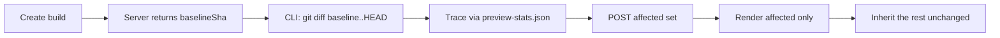

Affected capture is StoryShelf's answer to Chromatic's TurboSnap: instead of rendering every story on every build, the server renders only the stories downstream of your change and inherits the rest unchanged from their baselines. It is **on by default** and fails open — anything it cannot prove unchanged gets rendered.

## How it works



1. **Ancestor.** `POST /api/v1/projects/:slug/builds` returns `baselineSha`: the latest prior commit on the same branch with a build (`null` for first builds).
2. **Changed files.** The CLI diffs `baselineSha..HEAD` (plus staged and untracked files) to get the repo-relative change list.
3. **Trace.** The change list is traced through the bundler dependency graph (`preview-stats.json` in the built Storybook) down to story files. New stories — files with no baseline — always render regardless of the trace.
4. **Record.** The CLI posts `{ baselineSha, changedFiles, affectedImportPaths }` to `POST …/builds/:id/affected` before uploading the bundle, so the computation is auditable on the build row.
5. **Partition.** The orchestrator splits discovered stories into render vs inherit sets, renders only the affected ones, and creates `unchanged` snapshots for the rest that reuse the baseline screenshot (`inherited: true`). Counts include inherited snapshots; `changedCount` excludes them.

## Opting out

| Method | Effect |
|--------|--------|
| `storyshelf upload --full` | Render every story for this upload |
| `STORYSHELF_FULL=1` | Same, via env (useful for release pipelines) |
| `"affectedOnly": false` in `.storybook/storyshelf.json` | Disable for the project (see [Configuration](/guides/config/)) |

## Full-render fallbacks

Affected capture never fails an upload. When it cannot prove a story unchanged, it renders everything and prints the reason:

| Reason | Meaning |
|--------|---------|
| `shallow-clone` | No git history (`actions/checkout` needs `fetch-depth: 0`) or not a repository |
| `dependency-graph-unavailable` | No usable `preview-stats.json` in the built Storybook |
| `story-index-unreadable` | No `index.json`/`stories.json` to map stories to files |
| `global-file-changed` | A change touches `preview.*`, `manager.*`, `.storybook/main.*`, or a lockfile — these can affect every story |
| `too-many-changed-files` | Change list exceeds 10,000 files (large merges, vendored drops) |
| First build | No baseline commit exists yet (`baselineSha: null`) |

Typical CLI output:

```bash
Affected capture: rendering 3 stories (baseline abc1234)
# or
Affected capture: no stories affected (baseline abc1234)
# or
Full capture (shallow-clone): rendering all stories
```

## Tuning the trace

**Untraced files.** Files that appear in the graph but cannot meaningfully change rendering (generated clients, mock data, docs) can be excluded so touching them doesn't re-render their dependents:

```bash
storyshelf upload --untraced "**/*.generated.ts" --untraced "**/mocks/**"
```

Untraced files are dropped *before* tracing — stories reachable only through them are inherited. Stories reachable through another (traced) changed file still render.

**Custom stats file.** The graph is read from `<buildDir>/preview-stats.json` by default (emitted by the Vite builder). Override per run:

```bash
storyshelf upload --stats-file ./stats/preview-stats.json
```

**Diagnose.** `storyshelf doctor` reports affected-capture readiness: shallow clones and missing stats produce warnings (not failures).

## What you see in the UI

- The build page shows an `affected capture` badge (or `full capture` when opted out) plus `N rendered, M inherited` counts.
- Inherited snapshots carry an `inherited` badge and `unchanged` status — they need no review.
- Capture attempt logs include an `affected capture partitioned` line with `{ rendered, inherited, total }`.

## Differences from TurboSnap

Same shape (ancestor → diff → graph trace → selective render), different economics and scope:

- **No billed snapshots** — skipping saves your server's CPU, not money. There is no 0.2× copy charge because there is no billing at all.
- **Vite stats only** — the trace reads `preview-stats.json` (plus tolerant Webpack-reasons shapes). Custom builders without stats fall back to full renders.
- **Server verifies** — the orchestrator re-partitions from the stored payload and only inherits stories with a resolvable baseline, so a stale or forged list can only over-render, never under-test.

## Related

- [Capture & viewports](/concepts/capture/) — the render pipeline
- [Builds & snapshots](/concepts/builds/) — the `inherited` flag
- [Configuration](/guides/config/) — `affectedOnly` and precedence
- [CI setup](/guides/ci/) — `fetch-depth: 0` and upload flags
- Package: `@storyshelf/affected` (dependency tracing library)
