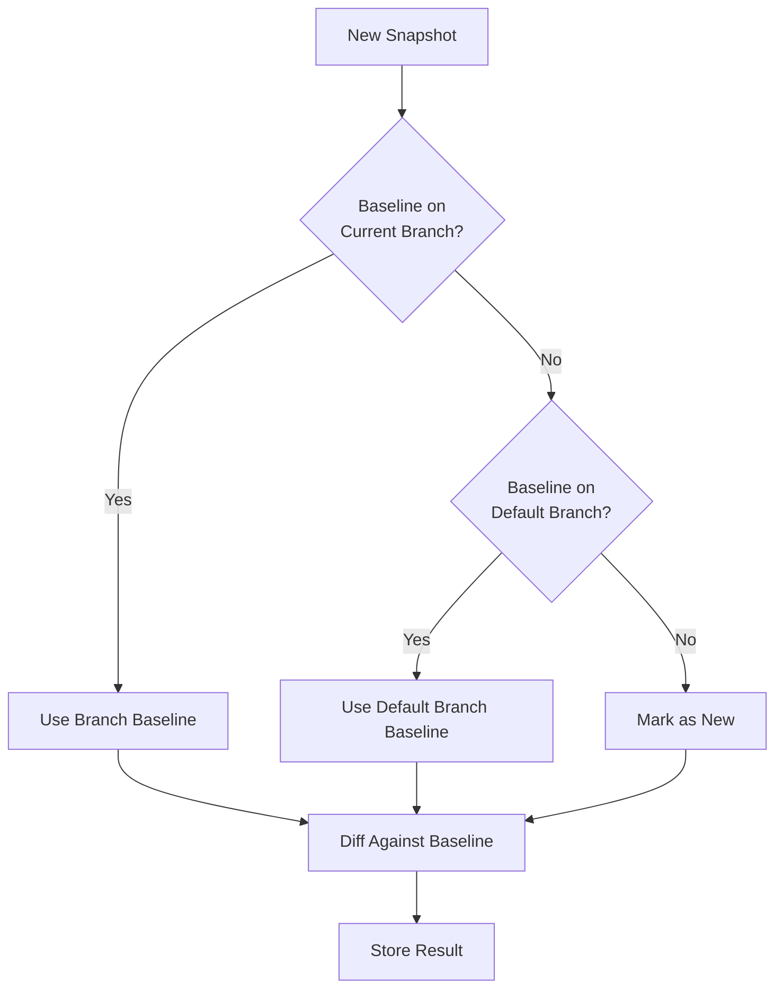
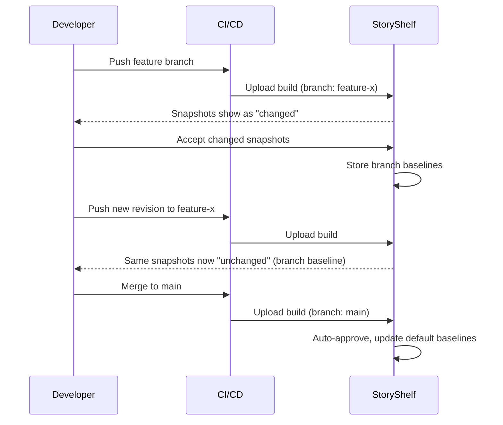
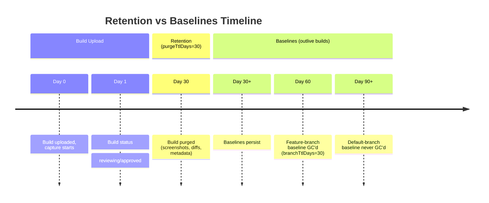

For each story and viewport, StoryShelf picks a baseline:

1. The **accepted baseline on the current branch**, if one exists.
2. Otherwise, the **default branch's** baseline.
3. If neither exists, the story is **new**.



## How baseline selection works

The three-step algorithm above runs for every snapshot during capture. This means:

- **Feature branches** get their own baselines once changes are accepted
- **Default branch** (usually `main`) acts as the fallback for all branches
- **New stories** on any branch start as "new" until accepted

## Default branch behavior

Builds on the default branch auto-approve and become the baselines. Pushing to `main` re-baselines the project — every snapshot on `main` updates the default-branch baseline.

| Config | Default | Description |
|--------|---------|-------------|
| `defaultBranch` | `main` | Branch that auto-approves and provides fallback baselines |

## Accepting changes on feature branches

Accepting a change on a feature branch records a baseline **for that branch**, so the next upload doesn't re-flag the same change. Merging to `main` promotes the baselines on the next default-branch build.



## Persistent builds & release tags

A build carrying the `persistent` label is never purged. On git checkouts the CLI attaches it automatically for revisions with git tags, so release builds survive retention.

```bash
# Tag a release → persistent label auto-attached
git tag v1.0.0
git push origin v1.0.0
# StoryShelf CLI detects tag → adds "persistent" label
```

Persistent builds are excluded from `purgeTtlDays` retention. Their snapshots remain as baselines indefinitely.

## Branch GC configuration

Feature-branch baselines are GC'd after `branchTtlDays` (default 30, `null` = disabled) of inactivity via a daily sweep (`branchGcIntervalMs` 24h). Default-branch baselines are never GC'd.

| Config | Default | Description |
|--------|---------|-------------|
| `branchTtlDays` | 30 | Days of inactivity before feature-branch baselines GC'd |
| `branchGcIntervalMs` | 86400000 (24h) | How often to run the GC sweep |
| `purgeTtlDays` | 30 | Days before terminal builds purged (separate from baselines) |



## Manual promotion (when needed)

Most teams never promote manually — pushing an accepted feature branch to `main` auto-promotes on the next default-branch build. If you need to pin a branch as a long-lived baseline (e.g., `release/2.0`), set that branch as the default in project settings or copy its baselines via the API.

API for manual promotion:
```bash
POST /api/v1/projects/:slug/baselines/promote
{ "sourceBranch": "release/2.0", "targetBranch": "main" }
```

## Debugging baseline selection

On the build detail page each snapshot shows `Baseline: <branch>@<buildId>` or `New` when no baseline exists. If a story is unexpectedly `New` on a PR, check:

1. No accepted baseline exists on the PR branch yet (accept once)
2. The default branch has a baseline for that story/viewport — otherwise the PR correctly has no ancestor

## Retention vs. baselines

Builds are transient and purged by `purgeTtlDays` (default 30); baselines outlive their builds and are stored separately. Purging a build does not delete its baseline — the next build on that branch still compares against it until `branchTtlDays` GC.

| What | Retention | Survives purge? |
|------|-----------|-----------------|
| Build metadata | `purgeTtlDays` | No |
| Screenshots | `purgeTtlDays` | No |
| Diff overlays | `purgeTtlDays` | No |
| Branch baselines | `branchTtlDays` | Until GC |
| Default-branch baselines | Never | Yes |
| Persistent builds | Never | Yes |

## API reference

- `GET /api/v1/projects/:slug/baselines` — List baselines
- `POST /api/v1/projects/:slug/baselines/promote` — Promote branch baselines
- `GET /api/v1/projects/:slug/builds/:id/snapshots/:snapshotId/baseline` — Get baseline for snapshot

## Common scenarios

| Scenario | Expected behavior |
|----------|-------------------|
| New story on feature branch | Status: `new` (no baseline anywhere) |
| Changed story on feature branch, first time | Status: `changed` (diff vs default branch) |
| Changed story on feature branch, after accept | Status: `unchanged` (diff vs branch baseline) |
| Merge feature branch to main | Default branch baselines updated on next main build |
| Delete feature branch | Baselines GC'd after `branchTtlDays` inactivity |
| Tag release (v1.0.0) | Build gets `persistent` label, never purged |
| Story deleted from Storybook | Baseline remains until GC (orphaned baseline) |