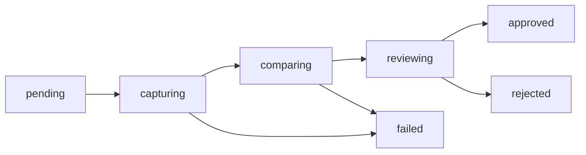

A **build** is one upload of a Storybook (one `POST /api/v1/projects/:slug/builds` + zip `PUT`). A **snapshot** is one screenshot for one `story × viewport` inside that build. A project holds many builds; each build holds many snapshots.

## Lifecycle



| Status | Meaning |
|--------|---------|
| `pending` | Uploaded, queued |
| `capturing` | Playwright/Puppeteer rendering |
| `comparing` | Diffing against baselines |
| `reviewing` | Diffs ready, needs human review |
| `approved` / `rejected` | Review complete |
| `failed` | Capture or `play` threw (blocking) |

Default-branch builds auto-approve and write baselines; feature-branch builds land in `reviewing`.

**Snapshots** track the diff result:

| Status | Meaning |
|--------|---------|
| `pending` | Not yet rendered |
| `new` | No baseline on this branch or default — needs accept |
| `changed` | Diff ratio exceeds `maxDiffRatio` / pixel threshold |
| `unchanged` | Within threshold — auto-approved |
| `approved` / `rejected` | Human decision |

`storyId` is `components-button--primary` (unique), plus `storyName`, `storyTitle`, and `viewportName` (`desktop` default `1280×720`). `diffPixels` / `diffRatio` / `diffPath` are populated only when a baseline exists.

## Attempts & logs

Each capture run records a `captureAttempts` row (attempt `1`, `2` on retry) and streams structured logs to `captureLogs`. Inspect per-attempt history:

- `GET /api/v1/projects/:slug/builds/:id/attempts`
- `GET /api/v1/projects/:slug/builds/:id/attempts/:no/logs`

Retry a flaky capture with `POST …/builds/:id/retry` or `storyshelf retry --build-id`.

## What outlives a build

Builds and snapshots are transient — purged after `purgeTtlDays` (see [Retention](/concepts/retention/)). Baselines are the truth and survive purge. A build bearing a `persistent` label (git tag, e.g. `v1.2.3`) is never purged; see [Baselines & branches](/concepts/baselines/) and [Labels](/concepts/labels/).

Find builds by branch/status/label:

```sh
curl "$SHELF/api/v1/projects/my-app/builds?branch=main&status=reviewing"
curl "$SHELF/api/v1/projects/my-app/builds?label_key=pr&label_value=42"
```

Stable label URLs (`/projects/:slug/labels/:key/:value`) always resolve to the latest build for that value.

## Related

- [Baselines & branches](/concepts/baselines/) — which screenshot is the expected one
- [Labels](/concepts/labels/) — typed values for search and stable URLs
- [Review workflow](/guides/review/) — approve/reject, comments, retry
- [Retention](/concepts/retention/) — what survives purge
