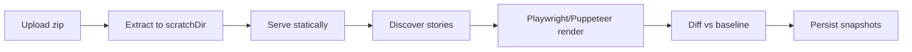

Capture is server-side. The CLI uploads a zipped static Storybook; the server extracts it, serves it locally, and screenshots every story.


## Pipeline



The **orchestrator** (`core/capture/orchestrator.ts`) owns loading, extraction (`scratchDir`), discovery (`StorySourceAdapter`), and persistence. The **CaptureRunner** is pure — it only returns PNG buffers:

```ts
interface CaptureRunner {
  render(input: { buildId, storybookDir, stories, viewports, browser?, executePlay?, playTimeoutMs? }): Promise<RenderResult>;
  cancel(buildId): Promise<void>;
}
```

Two runners ship — switch with one import:

| Runner | Package | Engines |
|--------|---------|---------|
| Playwright | `@storyshelf/runner-playwright` | `chromium` (default), `firefox`, `webkit`, `chrome` |
| Puppeteer | `@storyshelf/runner-puppeteer` | `chromium`/`chrome` only, `chrome-headless-shell` — smaller image |

Per-project engine lives in **Settings → General → Capture browser** or `PATCH /api/v1/projects/:slug { browser }`. Every snapshot records `infraHash = hash(browser + viewports + sizing defaults)` so baselines are browser-aware — switching browsers starts a fresh baseline.

## Viewports & sizing

Global viewports live in `ShelfConfig.viewports` (or project settings). Per-story `parameters.viewport` adds to the union (deduped by name). The runner auto-crops small components (≈60% whitespace) with 16px padding and clamp (`minWidth`/`maxWidth` etc.), and falls back to `fullPage` on overflow — see `core/capture/sizing.ts`.

Configure via server config or project patch. The queue then fans out `stories × viewports` renders at `captureConcurrency`.

## Content-addressed storage

Published Storybooks are deduplicated by content hash. `persistStorybookStatics` (`core/capture/statics.ts`) `sha256`s every file, writes once to `content/<hash>` (`storage.write(content/<hash>, buffer)` if missing), upserts `content_refs { hash, refCount, lastSeenAt }` via `db.tables.contentRefs` (type-safe `DatabaseAdapter.tables`, no `as never`), and writes a per-build `manifest.json` (`{ "assets/index.js": "abc..." }`). Serving prefers `manifest.json` → `content/<hash>` with `readWithManifestFallback`, falling back to the legacy per-build copy during migration. Uploads use the same dedup: `POST /dedup { hashes }` → `needed`, batch `POST /content` (multipart, `80%` bytes fallback `neededBytes/totalBytes > 0.8` → `PUT zip`), then `POST /manifest` — see [Publishing](/concepts/publishing/) and ADR 0020.

## Diffing

`pixelmatch` + `pngjs` compare against the selected baseline (see [Baselines](/concepts/baselines/)). Per-pixel `pixelThreshold` (default 0.1) and per-snapshot `maxDiffRatio` (default 0.01) decide `changed` vs `unchanged`; per-story `parameters.diffThreshold` (or `chromatic.diffThreshold` with `storyshelf` winning) overrides. Overlay is stored at `diffs/{storyId}/{viewport}.png` — 50% dim + red heatmap.

## Interaction testing hook

When **Enable interaction tests (play)** is on (per-project), the runner does `waitForSelector(#storybook-root, attached)` → `waitForTimeout(delay ?? 500)` → `page.evaluate(executePlay)` with `playTimeoutMs` before the screenshot. A throwing `play` maps to `failed` (blocking) or warning (flaky) — see [Interaction testing guide](/guides/interaction-testing/).

## Remote capture

On serverless (Vercel, Lambda, Workers) the API enqueues `CaptureQueue.enqueue({ buildId })` and a separate `@storyshelf/worker` polls (`SQS`, `Redis`, `Azure`) and runs the same orchestrator — see [Cloud assembly](/guides/deployment/cloud/).

## Related

- [Projects](/concepts/projects/) — slug, `git_default_branch`, thresholds
- [Builds & snapshots](/concepts/builds/) — statuses
- [Retention](/concepts/retention/) — what survives
- Packages: [runner-playwright](/packages/runner-playwright/), [runner-puppeteer](/packages/runner-puppeteer/), [worker](/packages/worker/)
