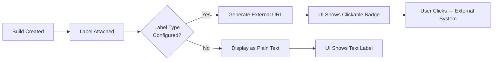

Labels identify related builds and link out to external systems. Types are project-defined: a GitHub team defines `pr`, a GitLab team `mr`, and either can add `jira`, `linear`, `figma`, `custom`.

Each type has a `link_template` that turns a value into an external URL:

| Type | Template |
|------|----------|
| `pr` | `https://github.com/{repo}/pull/{value}` |
| `mr` | `https://gitlab.com/{repo}/-/merge_requests/{value}` |
| `jira` | `https://myorg.atlassian.net/browse/{value}` |
| `linear` | `https://linear.app/{org}/issue/{value}` |
| `figma` | `https://figma.com/file/{value}` |
| `custom` | Any URL with `{value}` placeholder |



## Searching by labels

Use the project builds page filter or `GET /api/v1/projects/:slug/builds?label_key=pr&label_value=42` to find builds by label. Labels are indexed and paginated — a PR with 50 commits remains fast.

## Link templates in the UI

When a link template is configured, the build list and build detail pages render the label value as an external link. Example: a `pr` value `42` becomes a clickable `https://github.com/acme/app/pull/42` badge next to the build SHA.

The badge displays:
- Label key (e.g., `pr`)
- Label value as a link (e.g., `#42`)
- Hover shows full external URL

## Stable URLs

`/projects/:slug/labels/:key/:value` always shows the latest build bearing that label — a bookmarkable "latest build for this PR/issue" page. Share it in PR comments or Jira tickets so reviewers jump to the freshest diff without hunting build IDs.

Example: `https://shelf.example.com/projects/my-app/labels/pr/42`

## Configuring link templates

Add label types in project settings (Settings → Labels) or via `PATCH /api/v1/projects/:slug/settings`:

```json
{
  "labelTypes": [
    { "key": "pr", "link_template": "https://github.com/{repo}/pull/{value}" },
    { "key": "jira", "link_template": "https://myorg.atlassian.net/browse/{value}" }
  ]
}
```

`{repo}` is replaced with the project's `git_repository`, `{value}` with the label value. Omit `link_template` to keep the label as plain text.

## Common label types

| Key | Use case | Example template |
|-----|----------|------------------|
| `pr` | GitHub Pull Requests | `https://github.com/{repo}/pull/{value}` |
| `mr` | GitLab Merge Requests | `https://gitlab.com/{repo}/-/merge_requests/{value}` |
| `jira` | Jira Issues | `https://myorg.atlassian.net/browse/{value}` |
| `linear` | Linear Issues | `https://linear.app/{org}/issue/{value}` |
| `figma` | Figma Files | `https://figma.com/file/{value}` |
| `custom` | Any external system | Your custom URL pattern |

## Best practices

- **Use consistent keys** across projects (e.g., always `pr` for GitHub PRs) so stable URLs work predictably.
- **Define templates once** in project settings — the UI and API will use them automatically.
- **Prefer `pr`/`mr` over `custom`** for git providers — they get special handling in the UI.
- **Labels are per-project** — different projects can have different label types and templates.
- **No wildcards in group mapping** — exact match only to prevent accidental over-granting.

## API reference

- `GET /api/v1/projects/:slug/label-types` — List label types
- `POST /api/v1/projects/:slug/label-types` — Create label type
- `PATCH /api/v1/projects/:slug/label-types/:key` — Update label type
- `DELETE /api/v1/projects/:slug/label-types/:key` — Delete label type
- `GET /api/v1/projects/:slug/builds?label_key=:key&label_value=:value` — Filter builds by label

## Troubleshooting

| Issue | Cause | Fix |
|-------|-------|-----|
| Label shows as plain text | No `link_template` configured | Add template in Settings → Labels |
| External link broken | Template uses wrong placeholder | Use `{repo}` and `{value}` only |
| Label not filtering | Case mismatch in query | Query params are case-sensitive |
| Stable URL returns 404 | No build has that label yet | Label appears after first labeled build |