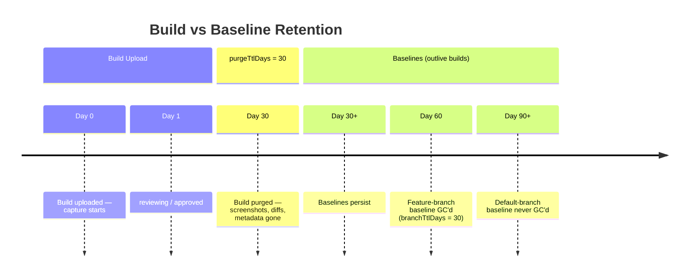

Everything below the **baseline** is transient. Baselines are truth.



## What survives purge

| What | Retention key | Survives? |
|------|---------------|-----------|
| Build metadata, screenshots, diff overlays | `purgeTtlDays` (default 30) | No — deleted together in one transaction |
| Storybook `content/<hash>` (shared, `content_refs` `refCount`) | `content_refs` 7-day grace (`refCount 0` kept 7d) | Yes — shared, refCounted, GC’d after grace |
| Branch baselines (`baselines/{branch}/**`) | `branchTtlDays` (default 30, `null` = disabled) | Until branch GC |
| Default-branch baselines (`baselines/main/**`) | Never | Yes |
| Builds bearing `persistent` label (git tags → `v1.2.3`) | Never | Yes, and their snapshots as baselines |

Retention keeps **the most recent build per branch** even past TTL — it’s the branch’s “current state” and powers label/PR links.

Non-terminal builds (`pending`/`capturing`/`comparing`/`reviewing`) are never purged.

## Orphan & branch GC

- **Orphaned baselines:** a story renamed/removed from Storybook never gets a natural diff. On each default-branch build, StoryShelf diffs `index.json` against `baselines` and deletes baselines whose `story_id` no longer exists.
- **Stale branches:** a daily sweep (`branchGcIntervalMs` 24h, staggered 1h) deletes `baselines/{branch}/**` files and rows for branches whose latest build is older than `branchTtlDays`. Default branch never GC’d.

## Triggers

- **Scheduled:** in-server timers (hourly build purge + daily branch GC).
- **Manual:** `storyshelf purge --url $SHELF_URL --token $STORYSHELF_ADMIN_TOKEN` or `POST /api/v1/admin/purge` (admin) — runs both sweeps and returns `{ removedBuilds, removedBranches, removedBaselines }`.

Configure via `ShelfConfig` or env:

```ts
createShelfApp({
  config: {
    purgeTtlDays: 30,
    branchTtlDays: 30,        // null to disable branch GC
    branchGcIntervalMs: 86_400_000,
    purgeIntervalMinutes: 60,
  },
});
```

Uploads ≤ `maxInlineUnzipSize` are extracted inline so the published Storybook is live immediately; larger ones wait for capture (required `null` on diskless hosts).

## Related

- [Baselines & branches](/concepts/baselines/) — which screenshot is expected
- [Builds & snapshots](/concepts/builds/) — build lifecycle
- [Labels](/concepts/labels/) — `persistent` label from git tags
- [Deployment — retention notes](/guides/deployment/) — `public_branch_regex` publishing
