# StoryShelf Architecture Diagrams

> Visual companion to [`architecture.md`](./architecture.md) and [`repo-structure.md`](./repo-structure.md).
> All diagrams are [Mermaid](https://mermaid.js.org/) — rendered natively on GitHub and in most Markdown previews.
> Source of truth for entities/interfaces remains `architecture.md`; these diagrams are derived views.

---

## 1. System Context (C4 Level 1)

Who uses StoryShelf and what it touches. The server is self-hosted — no vendor cloud in the loop.

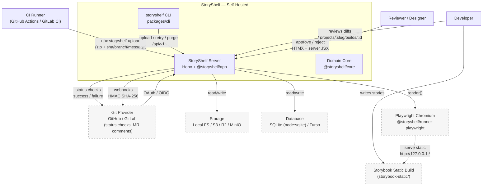

**Reads as:** the CLI builds/zips Storybook and uploads it (`architecture.md:14`); the server renders asynchronously via Playwright (`architecture.md:17`) without cloning the repo; reviewers approve in the server-rendered UI; the server posts commit statuses back to the git host (ADR 0010). Storage and database are swappable adapters.

---

## 2. Container / Monorepo Package Map (C4 Level 2)

How the monorepo maps to runtime containers. `nub` workspaces are `apps/*` + `packages/*`; `fixtures/*` are isolated `pnpm` installs (`repo-structure.md:8`).

```mermaid
flowchart TB
    subgraph CLI_pkg["CLI — packages/cli"]
        cli["storyshelf\ncommander\nupload / init / create / retry / purge / server init"]
    end

    subgraph Router["HTTP — packages/router"]
        hono["createShelfApp\npackages/router/src/index.tsx:44\nOpenAPIHono"]
        mw["Middleware\nrequestId / requestLogging\ninitGate / rateLimit / csrf\nstoreScope / authGate"]
        routes["Routers\nprojects / builds / snapshots\nlabels / tokens / members\nwebhooks / status-configs / admin\nhealth / media / storybook / ui"]
        pages["Pages + UI\npages/*.tsx (hono/jsx)\nui/DocumentLayout + HTMX\nassets/htmx (vendored)"]
        openapi["OpenAPI\n/api/v1/openapi.json\n/api/v1/docs (Swagger UI)"]
    end

    subgraph Core["Domain — packages/core"]
        adapters["Adapter Interfaces\ncore/adapter/*"]
        models["Models\ncore/models/*\n(constructor-injected)"]
        schema["Schema\ncore/schema/* + ddl.ts"]
        capture["Capture\ncore/capture/*\norchestrator / pipeline / queue\nstorybook discovery"]
        diff["Diff\ncore/diff\npixelmatch + pngjs"]
        retention["Retention\ncore/retention/purge.ts"]
        utils["Utils\ncore/utils + paths + urls\nlogger (pino) + config"]
    end

    subgraph DBadapters["Database Adapters"]
        dbsqlite["@storyshelf/db-sqlite\nnode:sqlite + Drizzle"]
        dbturso["@storyshelf/db-turso\n@libsql/client + Drizzle"]
    end

    subgraph StoreAdapters["Storage Adapters"]
        slocal["@storyshelf/storage-local\nfilesystem"]
        ss3["@storyshelf/storage-s3\nAWS S3 / R2 / MinIO"]
    end

    subgraph AuthAdapters["Auth Adapters"]
        aoauth["@storyshelf/auth-oauth\nOIDC"]
        apw["@storyshelf/auth-password\nshared password"]
    end

    subgraph CaptureAdapters["Capture Adapters"]
        runner["@storyshelf/runner-playwright\npure CaptureRunner"]
        qsqs["@storyshelf/queue-sqs\nSQS CaptureQueue"]
        qmem["InMemoryCaptureQueue\ncore/capture (default)"]
    end

    subgraph GitAdapters["Git Host Adapters"]
        ghub["@storyshelf/git-github\nOctokit"]
        glab["@storyshelf/git-gitlab"]
    end

    subgraph Apps["Apps (deployables)"]
        devsrv["apps/dev-server\nnub run serve (no build)"]
        flyapp["apps/fly-app\nrolldown bundle\nfly.yml"]
        website["apps/website\nAstro Starlight"]
    end

    subgraph Fixtures["Fixtures (not workspaces)"]
        f8["fixtures/storybook-8\nSB 8.6 / :6008"]
        f9["fixtures/storybook-9\nSB 9 / :6009"]
        f10["fixtures/storybook-10\nSB 10 ESM / :6010"]
    end

    cli --> hono
    hono --> mw --> routes --> pages
    hono --> openapi
    routes --> models
    models --> schema
    models --> adapters
    capture --> diff
    capture --> retention
    capture --> runner
    capture --> qmem
    capture -. alternative .-> qsqs
    dbsqlite --> schema
    dbturso --> schema
    slocal --> adapters
    ss3 --> adapters
    aoauth --> adapters
    apw --> adapters
    ghub --> adapters
    glab --> adapters
    devsrv --> hono
    flyapp --> hono
    website -. docs .-> hono
    f8 -. test only .-> runner

    classDef core fill:#e8f0fe,stroke:#4285f4;
    classDef adapter fill:#fef7e0,stroke:#fbbc04;
    classDef app fill:#e6f4ea,stroke:#34a853;
    classDef fixture fill:#f3e8fd,stroke:#9c27b0,stroke-dasharray: 5 5;
    class Core,hono,mw,routes,pages,openapi,capture,diff,retention,models,schema,utils,adapters core;
    class dbsqlite,dbturso,slocal,ss3,aoauth,apw,runner,qsqs,qmem,ghub,glab adapter;
    class devsrv,flyapp,website,cli app;
    class f8,f9,f10 fixture;
```

**Key rules:** primary export first (`repo-structure.md:46`); `core` is HTTP-free (`packages/core/src/index.tsx:1`); HTTP lives only in `router`; bundler rule `tsdown` for libs / `rolldown` for `apps/fly-app` (`repo-structure.md:15`).

---

## 3. Adapter Composition — `createShelfApp`

Every adapter implements `Adapter<Extra>` (`packages/core/src/adapters/metadata.ts:88`) — `metadata { name, version, kind, category }` + optional `lifecycle { init, close, health }`.

```mermaid
flowchart LR
    subgraph Options["ShelfOptions\npackages/core/src/config.ts:146"]
        db["database: DatabaseAdapter"]
        storage["storage: StorageAdapter"]
        runner2["captureRunner?: CaptureRunner"]
        queue["captureQueue?: CaptureQueue"]
        auth["auth?: AuthAdapter"]
        githosts["gitHosts?: GitHostProvider[]"]
        logger["logger?: Logger (pino)"]
        ui["ui?: UIConfig"]
        config["config?: ShelfConfig"]
    end

    createRouter["createShelfApp(options)\npackages/router/src/index.tsx:44"]

    subgraph Runtime["resolveRuntime(options)\npackages/router/src/runtime.ts"]
        cfg["ShelfConfig\nsecret / scratchDir\ncaptureConcurrency\npurgeTtlDays / viewports"]
        uicfg["UIConfig\nname / logo / theme"]
        log2["createShelfLogger()\npackages/core/src/logger.ts"]
    end

    subgraph Lifecycle["Lifecycle\npackages/router/src/lifecycle.ts:44"]
        init["attachLifecycle\nrunAdapterInits (Promise.allSettled)\napp.lifecycle { ready, init(), close() }"]
        gate["initGate middleware\n503 until settled"]
        health["GET /api/v1/health (liveness)\nPOST /api/v1/health (readiness)"]
    end

    subgraph Wiring["Wiring\npackages/router/src/index.tsx:74"]
        mw2["wireMiddleware\nrequestId / requestLogging\nrateLimit / csrf\nstoreScope(AsyncLocalStorage)\nauthGate"]
        qsetup["setupCaptureQueue\npackages/router/src/capture-setup.ts:14\nInMemoryCaptureQueue | SQS"]
    end

    subgraph Routes2["registerAllRoutes"]
        api["registerApiRoutes\nprojects / builds / labels\ntokens / members / webhooks"]
        pages2["registerPageRoutes\nassets / storybook / ui pages\nauth (if configured)"]
        docs["registerDocs\n/api/v1/openapi.json + /docs"]
    end

    Options --> createRouter
    createRouter --> Runtime --> Lifecycle --> Wiring --> Routes2
    qsetup --> Routes2
    Lifecycle --> health

    classDef opts fill:#fef7e0,stroke:#fbbc04;
    classDef router fill:#e8f0fe,stroke:#4285f4;
    class Options opts;
    class createRouter,Runtime,Lifecycle,Wiring,Routes2 router;
```

**Lifecycle:** `createShelfApp` kicks `lifecycle.init` eagerly (`Promise.allSettled`, `packages/router/src/lifecycle.ts:39`); callers `await app.lifecycle.init()` for fail-fast startup (migrations run here) or let first request gate on settlement (503 with per-adapter failures). `close()` on `SIGTERM`. Health is two-tier and ungated by init (`architecture.md:250`).

---

## 4. Request Lifecycle — Middleware Chain

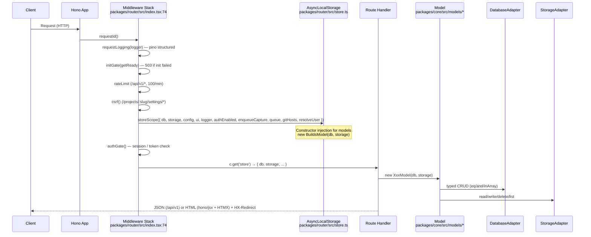

Conventions: IDs are ULIDs, timestamps ISO-8601 (`architecture.md:30`); `linkRoute()` for type-safe URLs; outbound HTTP via `httpJson`/`HttpError` (`core/utils`), never hand-rolled fetch (ADR 0019); structured logs `logger.info({ buildId }, "msg")` with `err` child (ADR 0014).

---

## 5. Capture Pipeline — End-to-End Sequence

Server-side render per ADR 0015 — the CLI never runs Playwright; the renderer is pure (`CaptureRunner.render → Buffer`, `packages/core/src/adapters/capture-runner.ts`).

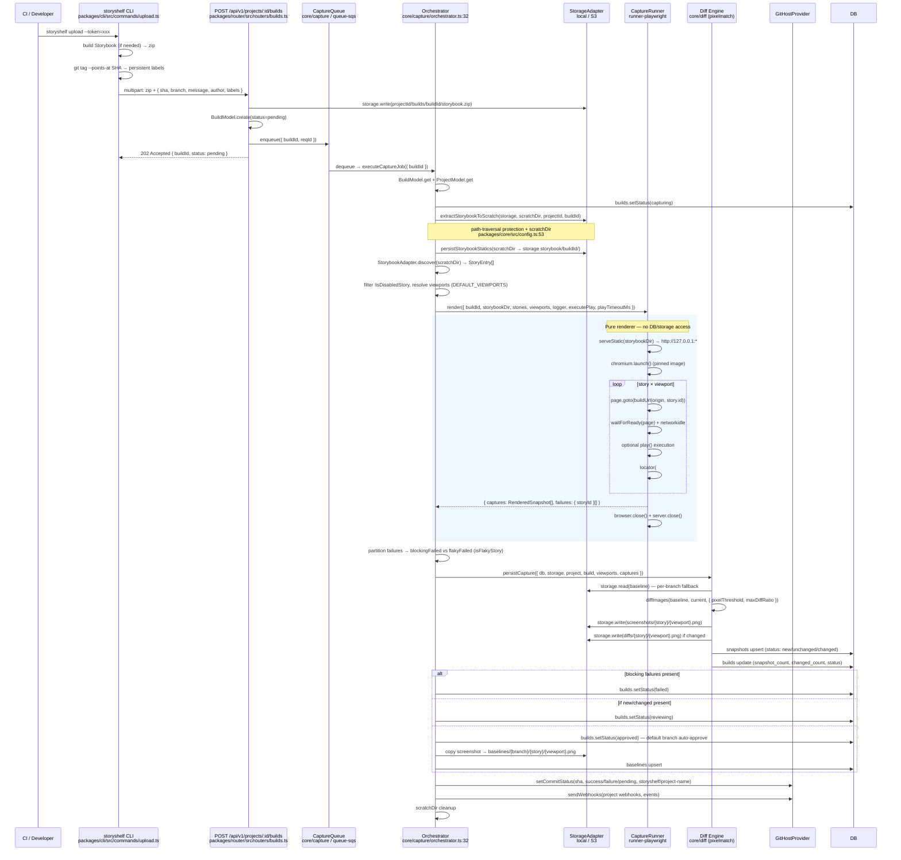

**Performance note:** v1 re-renders every story (`architecture.md:797` deferred TurboSnap); viewport concurrency is runner-internal; queue concurrency defaults to 2 (`ShelfConfig.captureConcurrency`).

---

## 6. Baseline Resolution & Review Workflow

### 6a. Baseline Resolution (per-branch fallback, ADR 0009)

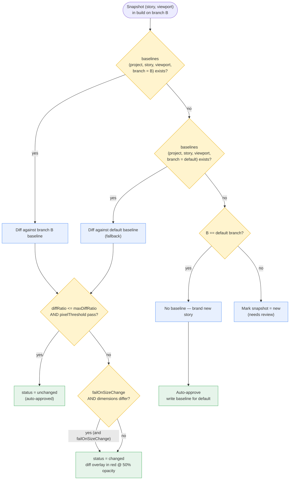

Accepting a diff on feature branch writes `baselines(branch=B)` so subsequent commits on `B` diff against the accepted version, not the untouched default (`architecture.md:371`).

### 6b. Build & Snapshot State Machine

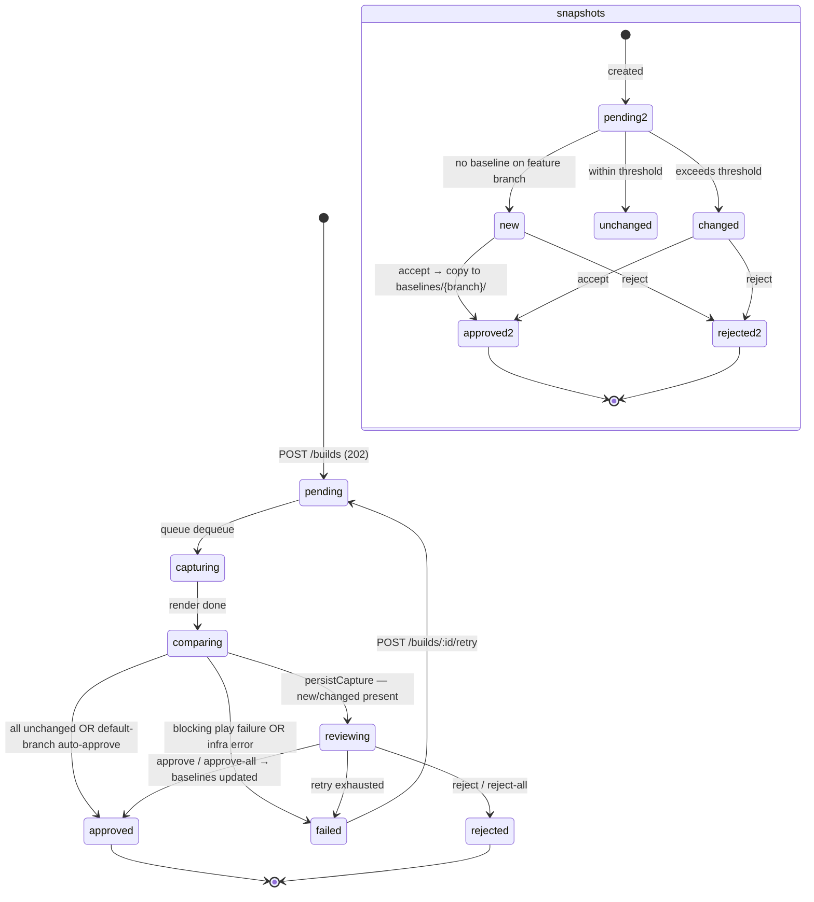

Snapshot `status` values (`architecture.md:81`): `pending|new|unchanged|changed|approved|rejected`. Build `status` (`architecture.md:55`): `pending|capturing|comparing|reviewing|approved|rejected|failed`.

---

## 7. Entity-Relationship Model

Derived from `architecture.md:31-181` and `packages/core/src/schema/*`. All PKs are ULIDs; timestamps ISO-8601.

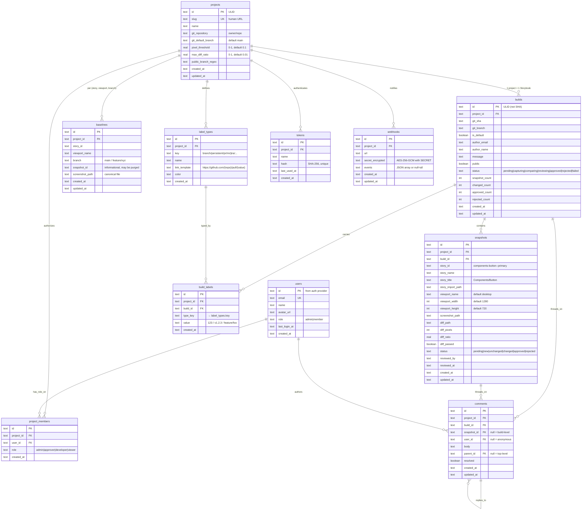

**Invariants:**
* `UNIQUE(build_id, story_id, viewport_name)` on snapshots; `UNIQUE(project_id, story_id, viewport_name, branch)` on baselines; `UNIQUE(project_id, user_id)` on members; `UNIQUE(build_id, type_key, value)` on build_labels.
* Baselines store canonical files — builds are transient and purged without losing truth (`architecture.md:225`).
* `persistent` label type is built-in, non-removable; `branch` is seeded; `build` is reserved (`architecture.md:488`).

---

## 8. Storage Layout

`--data-dir` (default `./data`) is a flat path namespace (`read/write/delete/exists/list`) — no container abstraction (`architecture.md:221`).

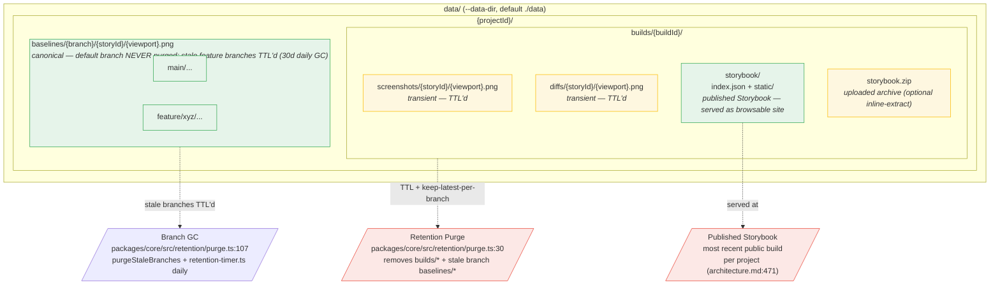

Upload path: CLI uploads `storybook.zip` → storage; orchestrator extracts to `scratchDir` (temp), then `persistStorybookStatics` copies to `storage/{projectId}/builds/{buildId}/storybook/` for serving (`packages/core/src/capture/orchestrator.ts:57`). `maxInlineUnzipSize` controls inline extraction at upload.

---

## 9. URL Model & Published Storybook

```mermaid
flowchart LR
    subgraph PublicAPI["JSON — /api/v1 (ULID ids)"]
        api1["GET /api/v1/projects"]
        api2["POST /api/v1/projects/:projectId/builds → 202"]
        api3["GET /api/v1/projects/:projectId/builds/:buildId/snapshots"]
        api4["POST .../snapshots/:id/approve"]
        api5["... /tokens /members /webhooks /admin/purge"]
    end

    subgraph HTML["HTML — / (slug ids)"]
        h1["GET / → projects list"]
        h2["GET /projects/:slug/builds/:buildId<br/>review page (diff + comments)"]
        h3["GET /projects/:slug/labels/:key/:value<br/>wildcard value, encodeURI"]
        h4["GET /projects/:slug/settings"]
    end

    subgraph Published["Published Storybook"]
        p1["GET /projects/:slug/storybook<br/>latest on default branch → 302"]
        p2["GET /projects/:slug/storybook/:key/:value<br/>latest bearing label → 302"]
        p3["GET /projects/:slug/storybook/build/:buildId/...<br/>canonical — serves assets"]
        sub["subdomain (optional)<br/>:slug.stories.example.com → default<br/>:buildId.:slug.stories.example.com → specific<br/>via publishedBaseDomain"]
    end

    PublicAPI -. same router .-> HTML
    HTML -. iframe .-> Published
    p1 --> p3
    p2 --> p3
    sub -. alternative .-> p3

    classDef api fill:#e8f0fe,stroke:#4285f4;
    classDef html fill:#fef7e0,stroke:#fbbc04;
    classDef pub fill:#e6f4ea,stroke:#34a853;
    class api1,api2,api3,api4,api5 api;
    class h1,h2,h3,h4 html;
    class p1,p2,p3,sub pub;
```

* HTML and published routes use `slug`; JSON uses ULID (`architecture.md:507`).
* `/storybook` and `/storybook/:key/:value` are resolvers (302) — assets served only under `/storybook/build/:buildId/...` to avoid `key/value` vs `assets/foo.js` collision (`architecture.md:477`).
* `public` = `builds.public` OR `branch` matches `projects.public_branch_regex`; otherwise auth + `viewer` membership required (ADR 0011).
* `linkRoute()` switches between path and subdomain forms based on `publishedBaseDomain`.

---

## 10. Labels — Typed Build Metadata

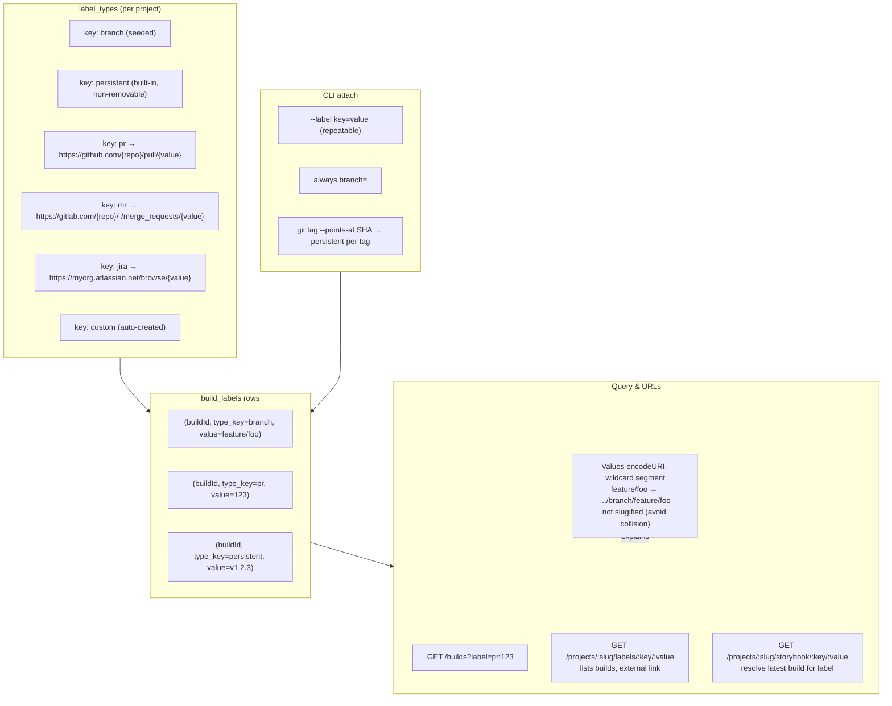

`build` is a reserved type key (route collision); latest build for `(key, value)` is an indexed join over `build_labels` → `builds`, no denormalized pointer (`architecture.md:502`).

---

## 11. Retention & Purge

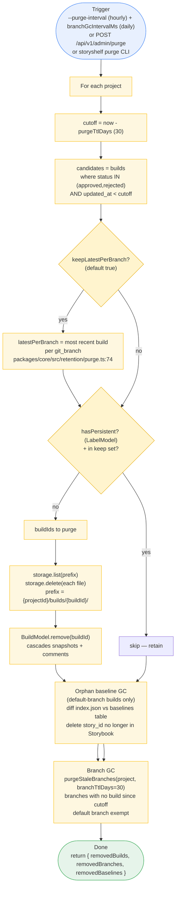

Never purged: `baselines/**` + builds with `persistent` label (`architecture.md:440`). Builds in non-terminal `reviewing` are not candidates.

---

## 12. Lifecycle & Health Probes

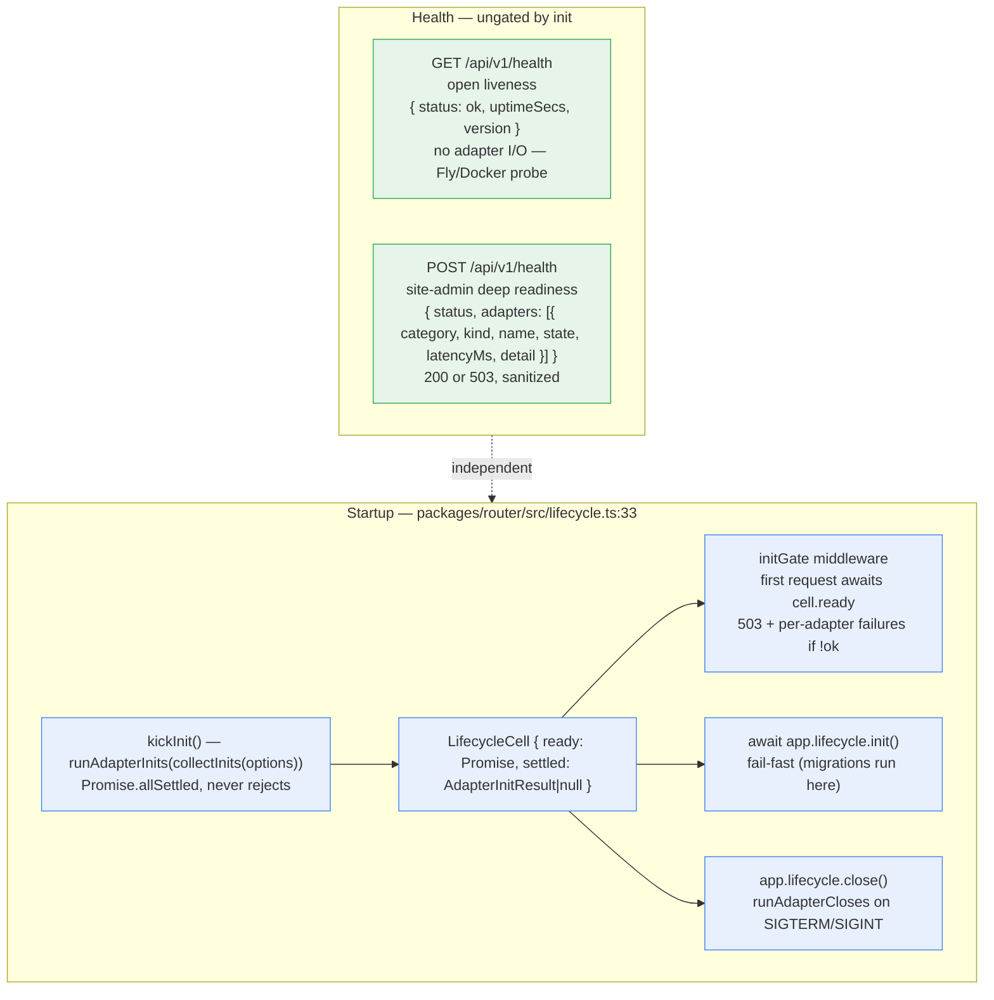

---

## 13. Deployment Topologies

### 13a. Local / Docker (recommended, `architecture.md:732`)

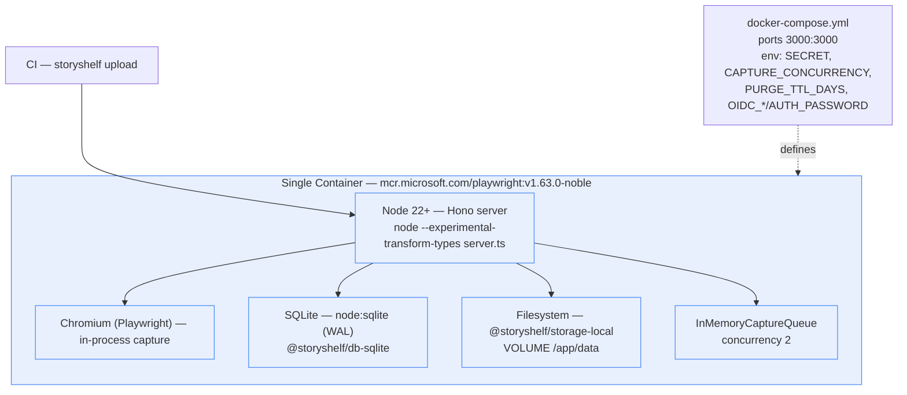

No Docker socket mount, no repo cloning; capture runs via the image's own browsers.

### 13b. Serverless / Cloud

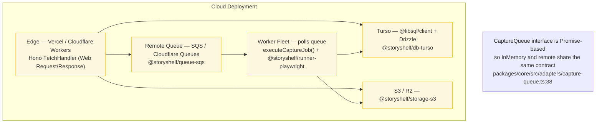

`createShelfApp` returns a plain `FetchHandler` — works on any runtime; only the in-process queue constrains Node (`architecture.md:247`).

### 13c. Dev (hot-restart from source, no build)

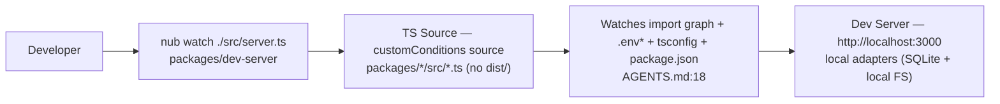

Matches StoryBooker pattern; `nubx turbo verify --force` for full check (`AGENTS.md:9`).

---

## 14. Auth & Access Control

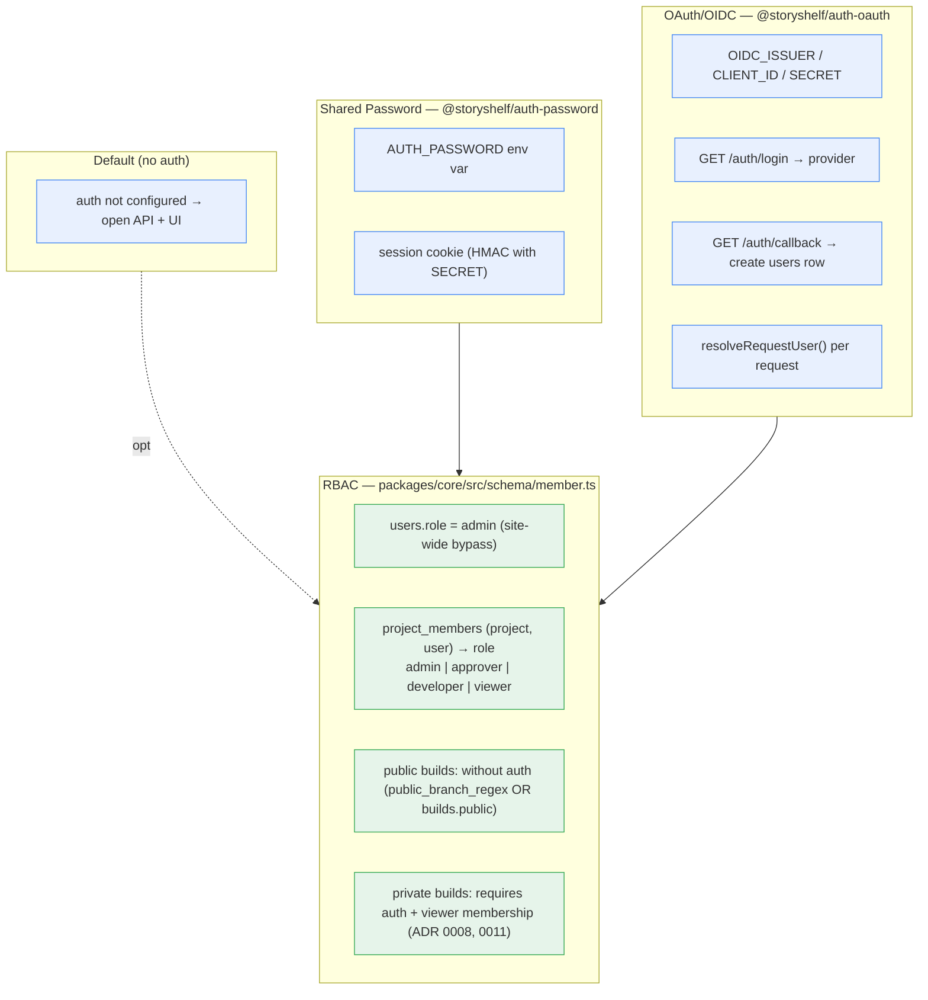

CLI uses API `tokens` (`hash` SHA-256) separate from user auth; tokens are per-project (`architecture.md:142`).

---

## 15. Diff Engine Detail

```mermaid
flowchart LR
    subgraph Inputs["Inputs"]
        Base["Baseline PNG<br/>baselines/{branch}/..."]
        Curr["Current Screenshot<br/>screenshots/..."]
        Opts["DiffOptions<br/>pixelThreshold (0-1, default 0.1)<br/>maxDiffRatio (0-1, default 0.01)<br/>includeAntialiasing<br/>failOnSizeChange"]
        Proj["Project overrides<br/>pixel_threshold / max_diff_ratio"]
    end

    Engine["diffImages() — core/diff<br/>pngjs decode → pixelmatch compare<br/>per-pixel color distance"]

    subgraph Outputs["DiffResult"]
        Passed["passed: boolean"]
        Pixels["diffPixels / diffRatio"]
        Overlay["diffImage: PNG overlay<br/>unchanged @ 50% opacity<br/>changed in red"]
        Dims["baselineDimensions / currentDimensions<br/>sizeChanged: boolean"]
    end

    FS2["Storage — write diff overlay if changed"]

    Inputs --> Engine --> Outputs --> FS2

    classDef input fill:#fef7e0,stroke:#fbbc04;
    classDef engine fill:#e8f0fe,stroke:#4285f4;
    classDef output fill:#e6f4ea,stroke:#34a853;
    class Base,Curr,Opts,Proj input;
    class Engine engine;
    class Passed,Pixels,Overlay,Dims,FS2 output;
```

Uses same libs Playwright does internally (`architecture.md:424`); overlay stored as `diffs/{story}/{viewport}.png`.

---

## Appendix: Diagram Index & Maintenance

| # | Diagram | Type | Source Entities |
|---|---------|------|----------------|
| 1 | System Context | flowchart | `architecture.md:11` workflow |
| 2 | Package Map | flowchart | `package.json` workspaces, `repo-structure.md` |
| 3 | Adapter Composition | flowchart | `packages/router/src/index.tsx:44`, `core/config.ts:146` |
| 4 | Middleware Chain | sequence | `packages/router/src/index.tsx:74`, `router/middleware/*` |
| 5 | Capture Pipeline | sequence | `core/capture/orchestrator.ts:32`, `runner-playwright` |
| 6 | Baseline Resolution | flowchart | `architecture.md:363`, ADR 0009 |
| 7 | State Machine | stateDiagram | `architecture.md:55,81` |
| 8 | ER Model | erDiagram | `architecture.md:31`, `core/schema/*` |
| 9 | Storage Layout | flowchart | `architecture.md:204`, `core/utils/paths.ts` |
| 10 | URL Model | flowchart | `architecture.md:471`, `core/urls.ts` |
| 11 | Labels | flowchart | `architecture.md:490`, `core/schema/label.ts` |
| 12 | Retention | flowchart | `core/retention/purge.ts:30`, ADR 0009 |
| 13 | Lifecycle/Health | flowchart | `router/lifecycle.ts:33`, `architecture.md:250` |
| 14 | Deployment | flowchart ×3 | `architecture.md:732`, `docs/adr/*` |
| 15 | Auth/RBAC | flowchart | `architecture.md:199`, ADR 0008 |
| 16 | Diff Engine | flowchart | `core/diff`, `architecture.md:405` |

**When to update:**
* New adapter → §2 and §3.
* New entity/column → §8 + `architecture.md:31`.
* Capture flow change → §5 (keep in sync with `core/capture/orchestrator.ts:32`).
* Deployment option → §13.
